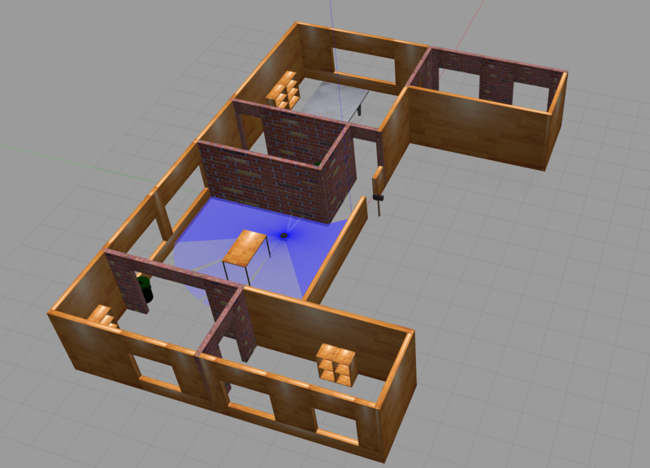

# MUSI-nav2: ROS2 Navigation Learning Environment

A complete, containerized ROS2 Humble environment for learning autonomous robot navigation with Nav2, TurtleBot3, Gazebo, and RViz2.


*TurtleBot3 Waffle navigating in simulated environment*

---

## Quick Start (5 Minutes)

### Prerequisites

- **Docker** 20.10+ and Docker Compose
- **8 GB RAM** (4 GB possible with [optimizations](docs/resource_optimization.md))
- **X11 server** for GUI (built-in on Linux, WSLg on Win11, XQuartz on macOS)

See [Installation Guide](docs/installation.md) for platform-specific setup.

---

### Setup

```bash
# Clone and build
git clone https://github.com/ericguerrero/MUSI-nav2.git
cd MUSI-nav2
./build.sh

# Start environment
./run.sh

# Access container
docker exec -it nav2_workspace bash
```

---

### First Simulation

```bash
# Inside container - launch TurtleBot3 in Gazebo
ros2 launch turtlebot3_gazebo turtlebot3_world.launch.py
```

**Wait 30-60 seconds** for Gazebo to load. You should see a simulated environment with a TurtleBot3 Waffle robot.

**Verify installation**:
```bash
ros2 pkg list | grep nav2        # 20+ packages
ros2 topic list                  # /scan, /odom, /cmd_vel, etc.
```

---

## What's Next?

### Learn Navigation

Follow the official Nav2 tutorials for comprehensive learning:
- **Getting Started**: https://docs.nav2.org/getting_started/index.html
- **SLAM and Navigation**: https://docs.nav2.org/tutorials/docs/navigation2_with_slam.html
- **Complete Tutorials**: https://docs.nav2.org/tutorials/index.html

### Use Our Exercises

Hands-on learning materials in [docs/exercises/](docs/exercises/):
- Navigation basics
- SLAM (mapping)
- Localization and path planning
- Advanced navigation techniques

---

## Documentation

- **[Installation Guide](docs/installation.md)** - Prerequisites and setup for Linux/WSL/macOS
- **[Troubleshooting](docs/troubleshooting.md)** - Common issues and solutions
- **[Resource Optimization](docs/resource_optimization.md)** - Run on low-spec systems (4 GB RAM)
- **[ROS2 Essentials](docs/ros2_essentials.md)** - Command reference and workflows
- **[Exercises](docs/exercises/)** - Hands-on navigation exercises

---

## Project Structure

```
MUSI-nav2/
├── Dockerfile              # Nav2 environment definition
├── docker-compose.yml      # Container orchestration
├── build.sh / run.sh / stop.sh  # Automation scripts
│
├── ros2_ws/                # Your ROS2 workspace (persistent)
│   └── src/                # Custom packages go here
│
└── shared/                 # Shared resources
    ├── maps/               # SLAM-generated maps
    ├── configs/            # Nav2 configurations
    └── worlds/             # Custom Gazebo worlds
```

---

## Environment Management

```bash
./run.sh         # Start environment
./stop.sh        # Stop environment (data preserved)

# Multiple terminals
docker exec -it nav2_workspace bash
```

---

## Resources

- **Nav2 Documentation**: https://docs.nav2.org/
- **ROS2 Humble Docs**: https://docs.ros.org/en/humble/
- **TurtleBot3 Manual**: https://emanual.robotis.com/docs/en/platform/turtlebot3/
- **GitHub Issues**: https://github.com/ericguerrero/MUSI-nav2/issues
